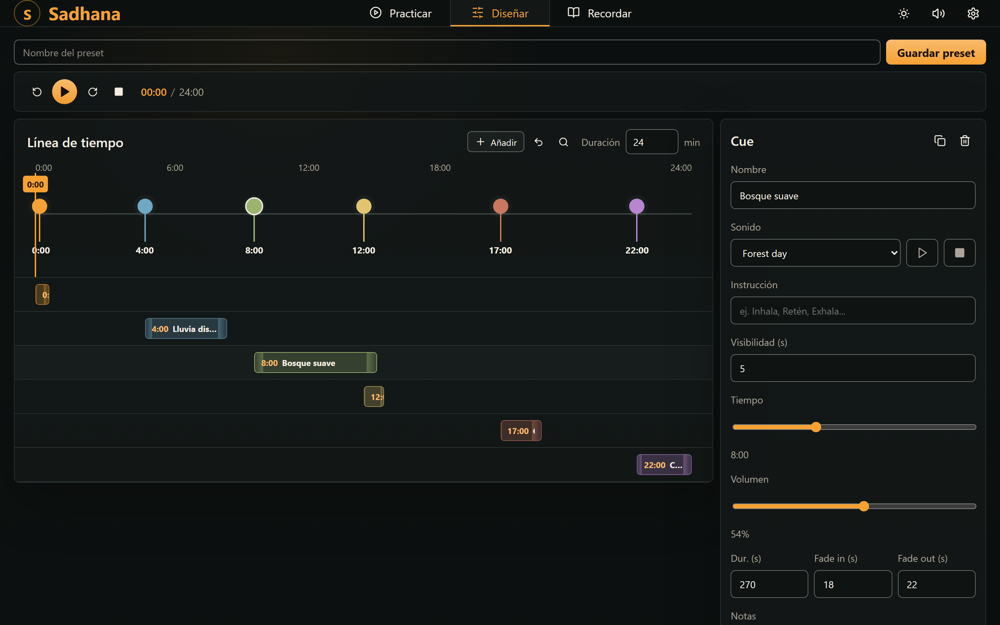
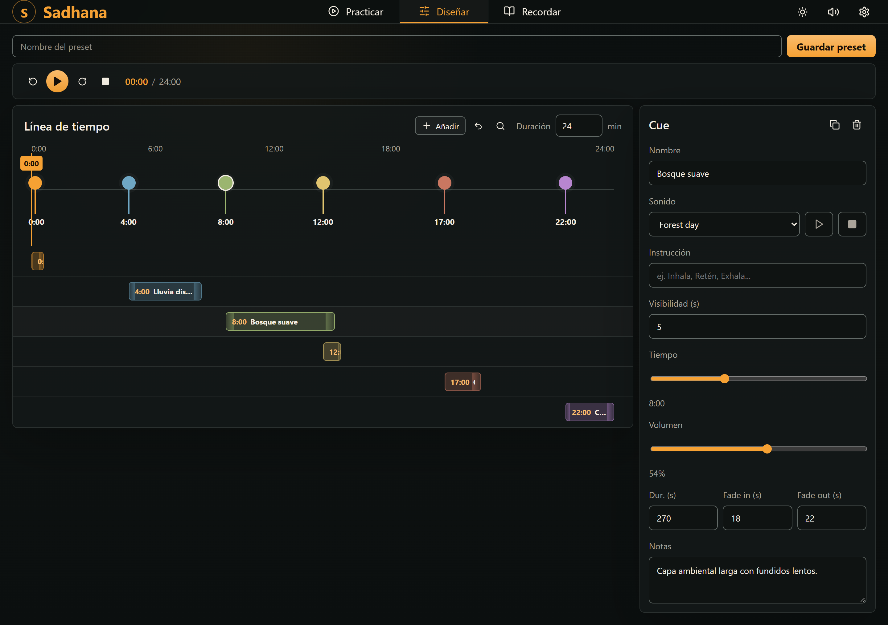
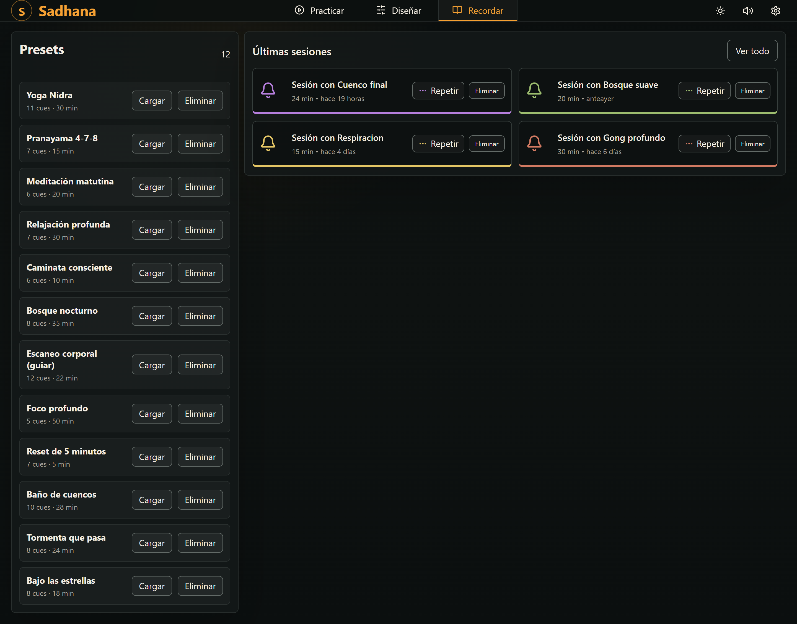

# sadhana

[](https://github.com/memoriainfinita/sadhana/releases)
[](https://memoriainfinita.github.io/sadhana/)
[](LICENSE)

Audiovisual/music app for guided sessions with audio, cues and practice history.

**Live:** https://memoriainfinita.github.io/sadhana/



## Modes

### Practice

Timer, cues and the active instruction. The screenshot above shows this mode.

### Design

Timeline with draggable cues, DAW-style fade clips, inspector.



### Remember

Presets and recent sessions.



## Stack

React 19 + Vite 6, pnpm.

## Scripts

```bash
pnpm dev     # development server
pnpm build   # production build
pnpm test    # tests (vitest)
```

## Features

- Twelve guided sessions seeded on first run, from a five-minute breathing reset to a fifty-minute focus block: crossfading ambient beds, layered singing bowls, and a body scan carrying a facilitator script in its cue notes.
- Audio scheduling with fade in/out and master volume.
- Persistent presets and sessions, exportable/importable.
- Homegrown i18n: 16 languages registered (es/en complete, Pali a partial easter egg). Preset names and cue instructions are localized too; anything you write yourself is left untouched.
- Accessibility: keyboard operation, visible focus, WCAG 1.4.11.

## License

GPL-3.0. See `LICENSE`.

## Credits

Developed by [@memoriainfinita](https://github.com/memoriainfinita) with the assistance of Claude (Anthropic): Opus 4.8, Sonnet 4.6 and Opus 5.
